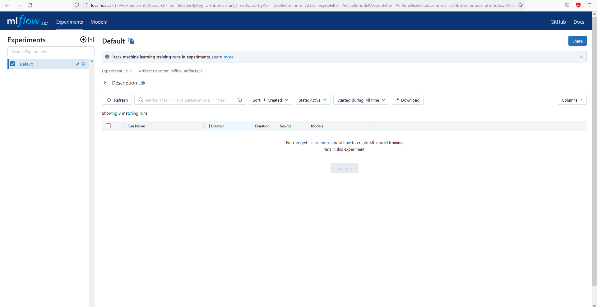

# Week 2
This week we will be having a closer look into connecting several docker containers.
We will setup an MLflow server to store the information about training experiments as well as as a SQLite database to store the models.
## Setup

#### Install Docker Compose
Follow the [link](https://docs.docker.com/compose/install/) to install Docker Compose for your platform OS.
#### SQLite
```sh
cd week2/
```
Create the database. Use the script located in [db/create.py](db/create.py). It will by default create a database at `db/store.db`. It is possible to change the name of the resulting database, however it is strongly advised to keep the defaults.
```python3
python db/create.py
```

---
## Second task
This week we will be dealing with three separate tasks. We want to:
- Run some training experiments
- Track their results and save the best model
- Serve the model to the public

Feel free to browse the code for this week.

### Launching MLflow
MLflow is an open source platform for the machine learning lifecycle. We will be using it to track our experiments and save trained models to the model registry. It can easily be hosted on your own machine. More on MLflow [here](https://www.mlflow.org/).

Let's launch the server!
Execute the following commands in your terminal.
```sh
docker build -t server:latest -f server/Dockerfile .
docker run -d -v "$(pwd)"/db:/db -p 2137:2137 server:latest
```

<details>
  <summary><b>How to fix "Got unexpected extra argument" error </b></summary>

If you are using Windows you might encounter the following error when running this command:
```sh
docker run -v ${PWD}/db:/db -p 2137:2137 server:latest
rror: Got unexpected extra argument (
./run_mlflow_server.sh: 4: ./run_mlflow_server.sh: --default-artifact-root: not found
./run_mlflow_server.sh: 5: ./run_mlflow_server.sh: --backend-store-uri: not found
./run_mlflow_server.sh: 6: ./run_mlflow_server.sh: --host: not found
./run_mlflow_server.sh: 7: ./run_mlflow_server.sh: --port: not found
```
The cause of the problem is related to how Docker handles line endings differently in Windows and any Linux/macOS system.
To fix it, change your end of line sequence. Below is an example of how to accomplish that in VS Code.

1. Open Command Palette (View -> Open Command Palette) or press `Ctrl+Shift+P`.

2. Type `Change End of Line Sequence` and press it.

3. Change it from `CLRF` to `LF`.

You can read more about it here:
https://www.aleksandrhovhannisyan.com/blog/crlf-vs-lf-normalizing-line-endings-in-git/

---

</details>

You should now be able to access http://localhost:2137.
The page will look more or less like this:



Great! So far so good. Let's get on with the next steps.
### Training
We now want to connect to our tracking application at http://localhost:2137. Let's see how this is implemented in the code.
```python
MLFLOW_TRACKING_URI = os.environ.get("MLFLOW_TRACKING_URI", default="http://localhost:2137")
mlflow.set_tracking_uri(MLFLOW_TRACKING_URI)
```

`os.environ.get()` will look for a specific environment variable in your system (in this case MLFLOW_TRACKING_URI). If the variable is not found, then the default value is supplied (http://localhost:2137). Just like python's `dict.get()`

We only need to tell mlflow to set the tracking URI to that of our hosted server, neat!
Let's train then!
Execute the following commands in your terminal.
```sh
docker build -t train:latest -f train/Dockerfile .
docker run -v "$(pwd)"/db:/app/db -v "$(pwd)"/mlflow_artifacts:/app/mlflow_artifacts -v "$(pwd)"/data:/data train:latest
```
Well, we get an error:
```sh
[11/21/22 19:35:59] WARNING  urllib3.connectionpool:       connectionpool.py:812
                             connectionpool.py:812 -
                             Retrying (Retry(total=4,
                             connect=4, read=5,
                             redirect=5, status=5)) after
                             connection broken by
                             'NewConnectionError('<urllib3
                             .connection.HTTPConnection
                             object at 0x7f7af44d42b0>:
                             Failed to establish a new
                             connection: [Errno 111]
                             Connection refused')':
                             /api/2.0/mlflow/experiments/c
                             reate
```
Let's debug then, perhaps something is wrong with the Dockerfile or the training script?
The script should also work outside the container, so let's check that.
Change the directory to train and create a virtual environment.
```sh
cd train/
python -m venv env
```
Activate it
- Linux/MacOS:
```sh
source ./env/bin/activate
```
- Windows:
```sh
.\env\Scripts\activate
```
Install the dependencies:
```sh
pip install --upgrade wheel
pip install -r requirements.txt
```
Run the training script:
```sh
python train.py
```
Output should be similar:
```bash
(env) ~/Docker-tutorial/week2/train$ python train.py
[I 2022-11-21 19:50:44,329] A new study created in memory with name: no-name-15995f33-ba08-4d7f-88bd-655bfa71aa46
[I 2022-11-21 19:50:55,513] Trial 0 finished with value: 0.9468766359515651 and parameters: {'max_depth': 24, 'n_estimators': 854}. Best is trial 0 with value: 0.9468766359515651.
[I 2022-11-21 19:51:03,199] Trial 1 finished with value: 0.9477525483603243 and parameters: {'max_depth': 14, 'n_estimators': 584}. Best is trial 1 with value: 0.9477525483603243.
[I 2022-11-21 19:51:10,932] Trial 2 finished with value: 0.9468766359515651 and parameters: {'max_depth': 24, 'n_estimators': 718}. Best is trial 1 with value: 0.9477525483603243.
[I 2022-11-21 19:51:15,799] Trial 3 finished with value: 0.9468766359515651 and parameters: {'max_depth': 23, 'n_estimators': 453}. Best is trial 1 with value: 0.9477525483603243.
[I 2022-11-21 19:51:25,127] Trial 4 finished with value: 0.947168606754485 and parameters: {'max_depth': 15, 'n_estimators': 869}. Best is trial 1 with value: 0.9477525483603243.
[I 2022-11-21 19:51:28,037] Trial 5 finished with value: 0.9474605775574046 and parameters: {'max_depth': 5, 'n_estimators': 276}. Best is trial 1 with value: 0.9477525483603243.
[I 2022-11-21 19:51:34,208] Trial 6 finished with value: 0.9465846651486455 and parameters: {'max_depth': 39, 'n_estimators': 577}. Best is trial 1 with value: 0.9477525483603243.
[I 2022-11-21 19:51:43,138] Trial 7 finished with value: 0.9465846651486455 and parameters: {'max_depth': 25, 'n_estimators': 837}. Best is trial 1 with value: 0.9477525483603243.
[I 2022-11-21 19:51:45,666] Trial 8 finished with value: 0.9465846651486455 and parameters: {'max_depth': 18, 'n_estimators': 232}. Best is trial 1 with value: 0.9477525483603243.
[I 2022-11-21 19:51:51,687] Trial 9 finished with value: 0.9468766359515651 and parameters: {'max_depth': 19, 'n_estimators': 563}. Best is trial 1 with value: 0.9477525483603243.
Successfully registered model 'StrokePredictor'.
2022/11/21 19:51:54 INFO mlflow.tracking._model_registry.client: Waiting up to 300 seconds for model version to finish creation.                     Model name: StrokePredictor, version 1
Created version '1' of model 'StrokePredictor'.
[11/21/22 19:51:54] INFO     docker_tutorial: train.py:113 - Best trial params:                                                                                                                                                                          train.py:113
                    INFO     docker_tutorial: train.py:115 - max_depth: 14                                                                                                                                                                               train.py:115
                    INFO     docker_tutorial: train.py:115 - n_estimators: 584                                                                                                                                                                           train.py:115
```
It works?


Lets try to understand the situation.
The server container exposes port 2137 to the public. How can we check it?
Find your container and [inspect](https://docs.docker.com/engine/reference/commandline/inspect/) it.
```sh
docker ps
docker inspect YOUR_SERVER_CONTAINER_ID
```
The output is quite verbose and since we are only interested in the network section we can filter the output.
```sh
docker inspect --format='{{json .NetworkSettings.Networks}}' YOUR_SERVER_CONTAINER_ID
docker inspect --format='{{json .NetworkSettings.Ports}}' YOUR_SERVER_CONTAINER_ID
```
The container is connected to a network called `bridge`. All containers without a --network specified, are attached to the default bridge network. You can check it on the stopped training container.
```sh
docker ps -a
docker inspect --format='{{json .NetworkSettings.Networks}}' YOUR_TRAIN_CONTAINER_ID
```
The training container however runs in isolation from the host and does not expose any ports. It can communicate with other containers in the same network by referencing their IP address. Let's try.
To get the IP address of your server container get it's IP
```sh
docker inspect -f '{{range.NetworkSettings.Networks}}{{.IPAddress}}{{end}}' YOUR_SERVER_CONTAINER_ID
```
Passing the IP via an environment variable is possible because of the following line:
```python
MLFLOW_TRACKING_URI = os.environ.get("MLFLOW_TRACKING_URI", default="http://localhost:2137")
```
We can pass it to the container run command
```
cd ~/Docker-tutorial/week2
docker run -v "$(pwd)"/db:/app/db -v "$(pwd)"/mlflow_artifacts:/app/mlflow_artifacts -v "$(pwd)"/data:/data -e MLFLOW_TRACKING_URI=http://YOUR_SERVER_CONTAINER_IP:2137 train:latest
```
Success! But his is getting quite tedious. What if you had to connect three or more containers?

Here are some questions for you to answer:
- What if the container's IP changes?
- Can this be done in any other way, perhaps simpler?
- What are the advantages and disadvantages of connecting to the default `bridge` network?

Networking in Docker is quite complex. I encourage you to read more about it.

Let's explore simpler options, particularly [Docker Compose](https://docs.docker.com/compose/).
The compose file uses a yaml syntax to configure services. It is very easy to switch from regular Docker CLI Docker Compose as the syntax is very much the same or similar. You can read more on the compose specification [here](https://docs.docker.com/compose/compose-file/)
All services within the compose file unless explicitly defined otherwise, share the same network. You need not know the IP address of a service's container. You can simply reference it using the service name.
Take a look at [docker-compose.train.yml](docker-compose.train.yml).
```Dockerfile
version: "3.8"

services:
  train:
    image: train:latest
    build:
      context: .
      dockerfile: train/Dockerfile
    volumes:
      - ./data:/data
      - ./db:/app/db
      - ./mlflow_artifacts:/app/mlflow_artifacts
    depends_on:
      - mlflow_server
    environment:
      MLFLOW_TRACKING_URI: http://mlflow_server:2137

  mlflow_server:
    image: server:latest
    build:
      context: .
      dockerfile: server/Dockerfile
    ports:
      - "2137:2137"
    volumes:
      - ./db:/db
```
This simple file defines pretty much everything that we have accomplished earlier. It provides instruction how to build and tag the images for each service, volumes and environment variables for the containers. You can now stop your server container.
To build and run the training and the server container simply run
```sh
docker-compose -f docker-compose.train.yml build
docker-compose -f docker-compose.train.yml up
```
or to combine both commands
```sh
docker-compose -f docker-compose.train.yml up --build
```
If you removed or renamed a service in your compose file, you can run this command with the --remove-orphans flag to clean it up.
```sh
docker-compose -f docker-compose.train.yml up --build --remove-orphans
```


### Serving

With our current knowledge building and launching the serving container is a matter of seconds.
We use second yml file that configures serving app to expose the FastAPI service.
```sh
docker-compose -f docker-compose.app.yml up --build --remove-orphans
```
You can also launch it in detached mode and inspect the logs. Most of the commands for compose are similar.
```sh
docker-compose -f docker-compose.app.yml up -d --build --remove-orphans
docker-compose -f docker-compose.app.yml logs
```

Play with your model endpoint and MLflow server. You have done it!

A question for you:
- The current implementation is juggling the `model_server` service. It is used in both `docker-compose.train.yml` and `docker-compose.yml` and being overriden. Can you think of a better way to share it between those two files?
Tip: https://docs.docker.com/compose/extends/
---

## <center>HOMEWORK </center>
1. Answer the questions in **Train** and **Serve** section.
2. Take a look at [server/Dockerfile](server/Dockerfile). Particularly how PORT and DB_DEST ARGs are handled and passed to [server/run_mlflow_server.sh](server/run_mlflow_server.sh). They can be passed with `docker build --build-arg ARG=ARG_VALUE`. What are the advantages and disadvantages of supplying arguments like that? Is it the most efficient way to implement it for this particular case?
3. Find a project that you think would benefit from using Docker. Dockerize it and write a simple documentation (e.g. how to build and run -> 2 commands). This can be any project - pet project, university assignment, random github repo or your own work project.

Good luck!

### <center> Congratulations! </center>
### You have completed the tutorial. You are more than ready to dive deep into the world of containers.

---

#### Additional read

https://docs.docker.com/compose/extends/

https://www.tutorialworks.com/container-networking/

https://stackoverflow.com/questions/38907708/docker-ipc-host-and-security

https://releasehub.com/blog/6-docker-compose-best-practices-for-dev-and-prod

https://docs.docker.com/network/network-tutorial-standalone/

https://github.com/docker/awesome-compose


